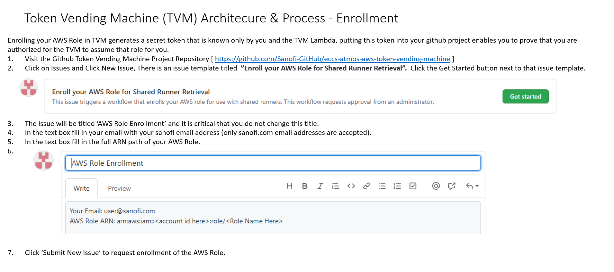
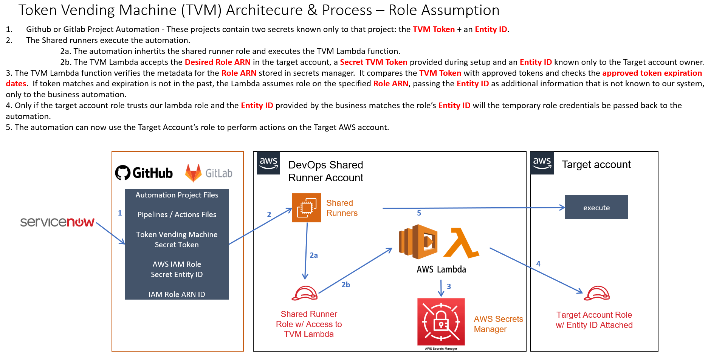
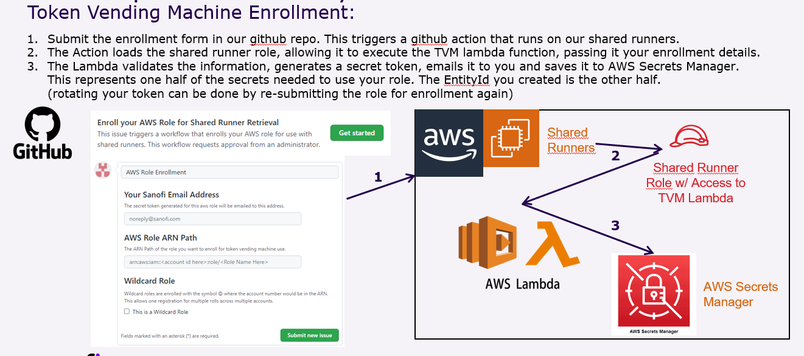

# eccs-atmos-aws-token-vending-machine
Enterprise Cloud Computing ATMOS Token Vending Machine solution for Amazon Web Services.

# Runners
This repo uses the following runners:

|Environment|Github org|Runner|Agent Directory| label | group |
|---|---|---|---|---|---|
|AWS DevOps Development Account| Sanofi-GitHub |i-0f9d0f5f6ec1670c9 | /home/cloud-user/sanofi_action_runner| aws-devops-dev| eccs-devops |
|AWS DevOps Production Account | Sanofi-Github | i-005ea36e57d70efc2 | /home/cloud-user/sanofi-action-runner | aws-devops-production | eccs-devops |
|AWS DevOps Production Account | Sanofi-Github | eks shared runners |  | atmos-aws-shared-gh-runner |  |

# Repository Contents
#### /automation
enrollment.py : script used by the auto-enrollment-dev.yml github action to automate the process of adding new aws roles to the token vending machine.

#### /least-rights-runner-deployment

a terraform project for deploying a github runner with minimal rights to only access the token vending machine lambda function.  This runner is intended to be used to test the TVM to assume other roles with greater rights in AWS.  It's deployed using github actions.

#### /tvm_lambda

a terraform project which deploys a lambda function and associated iam role and secrets which can be used by a shared runner environment to securely provide IAM role assumption services across any number of AWS accounts.  Proper setup of the roles to be set up is required.  Enrollment of roles to be assumed using TVM must be enrolled using automation located in this repository which is triggered by creating an issue using the TVM Enrollment issue template.

# Solution Description

The aim of the Token Vendor Machine solution is to address the following requirements: 

- New security constraints preventing the usage of static encryption keys and AD service account to access AWS or Azure accounts. 

- The GitHub Runner has limitation compared to legacy GitLab, they can only execute one job at a time. This limitation would force project teams to increase the number runners to afford their workload 

- With GitLab, the number of dedicated runners drastically increased. We want projects to use a shared runner. TVM will ensure each project will connect to the authorized AWS/Azure Account  

The TVM (Token Vending Machine) solution addresses this by using a lambda function to retrieve temporary AWS Role credentials in another AWS Account from the sanofi Github Shared Runners. This eliminates the need for teams to stand up runners in every AWS Account.

# Creating an AWS role for use with TVM

<details> <summary>Click to expand instructions</summary>

If you use terraform to deploy your AWS objects, creating a role to be assumed by TVM is simple.  Add a new resource to your terraform project that looks like the example below. 

If you create your roles through the AWS Console, you can use the examples and values below to create the role using the IAM Role wizard in the AWS IAM Console. The Name, Permissions Boundary, and statement (including principal and condition) can all be entered using the wizard using the terraform example below as a reference.

You'll need to update the following strings with the correct values for your AWS account.

name = "App_roleretriever_lambda_assume" can be set to any role name you choose.  Note that Sanofi best practices state that your application objects should start with the name "App_".  Some roles, such as highly privilaged AppAdminRunner roles must begin with CE_ and can only be created by the AWS Foundation team using this request form: [Sanofi OneSupport Portal](https://sanofiservices.service-now.com/onesupport?id=sc_cat_item_guide&table=sc_cat_item&sys_id=ec57c51b1bd3fb8017d3fddacd4bcb9b)

each place you see <ACCOUNT_NUMBER> must be updated to your aws account number.

in the Principal you see <TVM_ARN> and must be updated to the full ARN of the Token Vending Machine lambda function. At the time this documentation was produced our Token Vending Machine Production ARN path is:

arn:aws:iam::095208641432:role/App_roleretriever_lambda

Under the role condition you see the external ID. This <EXTERNAL ID> must be updated with a secret value of your choosing. This acts like an additional token that is not known to the TVM solution and is only known by you and your project.  When you request the TVM to assume your role you will pass your TVM token along with this External ID to prove that you're truely the owner of this role.  Note that only those with access to your AWS account will be able to retreive this ExternalID. It's not to be treated as a password but it adds an additional layer of security when someone wishes to use the role.  Any attempt to assume an AWS role without passing a matching ExternalID will throw an error in the AWS API.

Example policy for reference:

```

name = "App_roleretriever_lambda_assume" # this could be changed to any name starting with App_
permissions_boundary = "arn:aws:iam::<ACCOUNT_NUMBER>:policy/CE_AppAdminBoundary"
assume_role_policy =

{
  "Version": "2012-10-17",
  "Statement": [
    {
      "Action": "sts:AssumeRole",
      "Principal": {
          "AWS": "arn:aws:iam::095208641432:role/App_roleretriever_lambda"
      },
      "Effect": "Allow",
      "Sid": "",
      "Condition": {
        "StringEquals": {"sts:ExternalId": "<EXTERNAL ID>"}
      }
    }
  ]
}


```

</details>


# Adding your AWS Role to TVM

<details> <summary>Click to expand instructions</summary>



</details>


# Using your AWS Role from TVM

<details> <summary>Click to expand instructions</summary>



### Recommended Method: reusable action

We provide a Github Action you can use in your workflows.
This example assumes that your jobs already have the AWS CLI installed.

```yml
name: tvm-test
jobs:
  tvm_test:
    steps:

      # The TVM requires the AWS CLI installed
      # In most cases you will need it later anyway
      - name: Install AWS CLI
        run: |
          curl "https://awscli.amazonaws.com/awscli-exe-linux-x86_64.zip" -o awscliv2.zip
          unzip awscliv2.zip
          sudo ./aws/install

      # Call the token vending machine
      - uses: Sanofi-GitHub/eccs-atmos-aws-token-vending-machine/action@v1
        with:
          targetRoleArn: "" # YOUR ROLE ARN HERE
          targetRoleExternalId: "" # YOUR EXTERNAL ID HERE
          tvmToken: "" # YOUR TVM TOKEN HERE
    
      # You can now access your AWS account
      - run: aws s3 ls
```

The external ID and TVM token are **sensitive values**.
They should be passed from Github Secrets, using `tvmToken: ${{ secrets.TVM_TOKEN }}`.

If your job uses a custom Docker image, you must mount the service account token.
This is also a sensitive value. You should always use a safe/controlled image (e.g. self-built or official image).

```yml
name: tvm-test

jobs:
  tvm_test:
    # This activates the github sanofi shared runners on AWS for this action
    runs-on: [self-hosted, atmos-aws-shared-gh-runner]
    container:
        image: sanofi-docker-atmos-local.jfrog.io/myimage
        volumes:
          - /var/run/secrets/eks.amazonaws.com/serviceaccount/token:/var/run/secrets/eks.amazonaws.com/serviceaccount/token
    steps:
      - uses: Sanofi-GitHub/eccs-atmos-aws-token-vending-machine/action@v1
```

### Deprecated method:

```yml
jobs:
  # This workflow contains a single job called "build"
  unit_tests_production:
    # The type of runner that the job will run on
    #runs-on: [self-hosted, eccsdevops-aws-dev]
    runs-on: [self-hosted, atmos-aws-shared-gh-runner]
    container:
      #image: alpine:latest
      image: MyDockerImage
      credentials:
      # the artifactory user name is the complete email address of the user in lowercase, example: gitlab-automation@sanofi.com
        username: ${{ secrets.DOCKER_USER}}
      # the artifactory token is obtained from the artifactory user's profile page and is used as-is (ie. no base64 encoding)
        password: ${{ secrets.DOCKER_TOKEN}}
      volumes:
        - /var/run/secrets/eks.amazonaws.com/serviceaccount/token:/var/run/secrets/eks.amazonaws.com/serviceaccount/token
    env:
      TF_VAR_IAM_ENTITYID: ${{ secrets.IAM_ENTITY}}
      AWS_WEB_IDENTITY_TOKEN_FILE: ${{ secrets.SHARED_GHRUNNER_AWS_WEB_IDENTITY_TOKEN_FILE }}
      AWS_ROLE_ARN: ${{ secrets.SHARED_GHRUNNER_AWS_ROLE_ARN }}
    

    # Steps represent a sequence of tasks that will be executed as part of the job
    steps:
      # Checks-out your repository under $GITHUB_WORKSPACE, so your job can access it
      - uses: actions/checkout@v2

      # Assume the aws role and set up the credentials for awscli/terraform
      - name: token vending machine unit test
        run: |
          aws lambda invoke --function-name arn:aws:lambda:eu-west-1:095208641432:function:App_RoleRetriever --payload '{"action": "getrole", "token": "${{ secrets.IAM_TOKEN}}", "role": "arn:aws:iam::MyAWSAccountID:role/MyRole", "externalid": "${{ secrets.IAM_ENTITY}}"}' --region eu-west-1 response.json
          export AWS_ACCESS_KEY_ID=$(cat response.json | jq -r . | jq .AccessKeyId | xargs)
          export AWS_SECRET_ACCESS_KEY=$(cat response.json | jq -r . | jq .SecretAccessKey | xargs)
          export AWS_SESSION_TOKEN=$(cat response.json | jq -r . | jq .SessionToken | xargs)
          export AWS_EXPIRATION=$(cat response.json | jq -r . | jq .Expiration | xargs)
```


</details>
  
# Quality Details

### Requirements
* A method for our our Github Organization shared runners to retreive temporary AWS Role credentials from a remote AWS account.
* A method to control what roles can be retreived using our Github Organization shared runners.

### Responsibilities
|Role|Name|Responsibility|
|---|---|---|
|Service Owner| Travis McDonald | Owner of the operational service and associated components|
|Developer | Nicholas Furno | In charge of the development of the automated use case|
|Tester| Joseph Park | In charge of reviewing the automated test execution|

### Specification / Workflows Definition




### Test Case Definition - Enrollment
|Step|Test steps|Expected Results|
|---|---|---|
|1| <p>* Fill out the "Enroll your AWS Role for Shared Runner Retrieval" Issue form on the Issues page of this repository.</p> | <p>* A repository issue will be created which will send out an approval request to an administrator."|
|2| <p>* Have an administrator approve the request.</p> | <p>* The enrollment action will run on the actions page of this repository for the "onboarding-production" environment. <p>The log line for this action containing the text: "enrollment response:" is expected to have the following entry: "'StatusCode': 200"</p><p>The final expected result will be that within 30 minutes an email will arrive to the email address that you provided containing the full ARN of the AWS role that was enrolled and this email will also contain a 64 character secret token.</p>|

### Test Case Definition - Unit Testing
|Step|Test steps|Expected Results|
|---|---|---|
|1| <p>* Manually Run the "unit_tests_production" github action in this repository</p> | <p>* The action should execute with a successful return status.</p><p>* Inside the action log, under the "uinit_tests_production" job, look under section "token vending machine unit test" for the following expected outcome: </p> <p>There should be a line indicating '"StatusCode": 200'</p> <p>There should be a line labeled "Response =" that contains an "AccessKeyId" field, a "SecretAccessKey" field a "SessionToken" field and an "Expiration" field. </p> <p>The secret values represented in this test have no aws permissions and only indicate that the test was successful.</p> |

